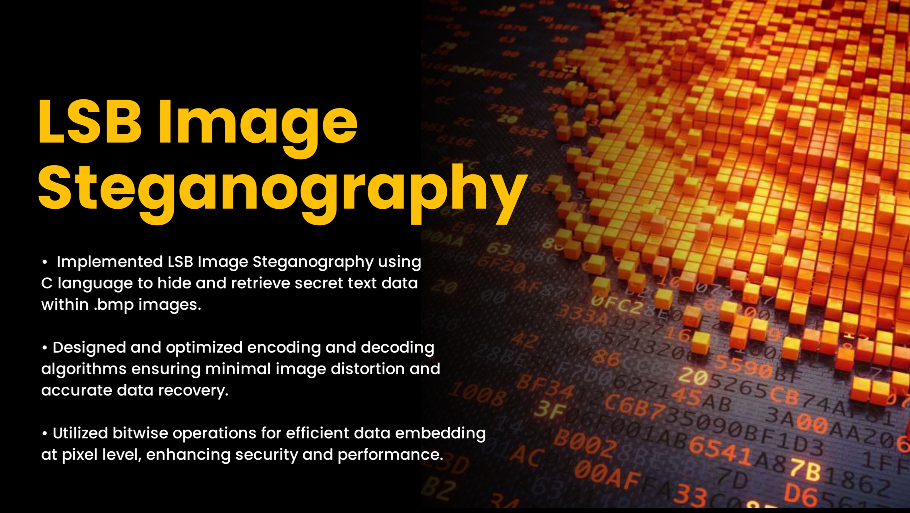

  

# 🖼️ LSB Image Steganography in C

A lightweight C project that demonstrates how to hide and retrieve secret text messages inside images using the **Least Significant Bit (LSB)** technique.

---

## 📘 Overview

This project implements **image steganography** in the **C programming language** by manipulating the pixel data of an image file.  
The hidden message is embedded into the least significant bits of each pixel’s color channel — a simple yet effective method to conceal data without noticeable image distortion.

---

## ✨ Features

- 🔒 Hide a secret text message in an image  
- 🧩 Extract the hidden message from a stego image  
- 🎨 Minimal or no visible change in image quality  
- 📁 Supports 24-bit BMP format for simplicity  
- ⚡ Fast, efficient C implementation  

---

## 🧠 How It Works

1. The program reads a **24-bit BMP** image.  
2. The secret message (in binary) is split into bits.  
3. Each bit replaces the **Least Significant Bit (LSB)** of one color channel byte (R, G, or B).  
4. The process continues until all bits of the message are embedded.  
5. The modified image is saved as a new **stego image**.  
6. During decoding, the LSBs are read back to reconstruct the original message.

Example:
Original byte: 11001010
Modified byte: 11001011 ← Only 1 bit changed!

yaml
Copy code

---

## 📂 Project Structure

📦 LSB-Steganography-C
├── main.c # Main entry file
├── encode.c # Functions to embed message into image
├── decode.c # Functions to extract hidden message
├── bmp.h # Header for BMP structures and helpers
├── Makefile # Optional: for easy compilation
├── input.bmp # Original image
├── output.bmp # Image with hidden message
└── README.md # Project documentation